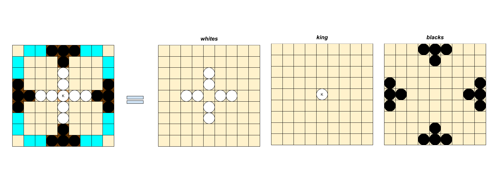
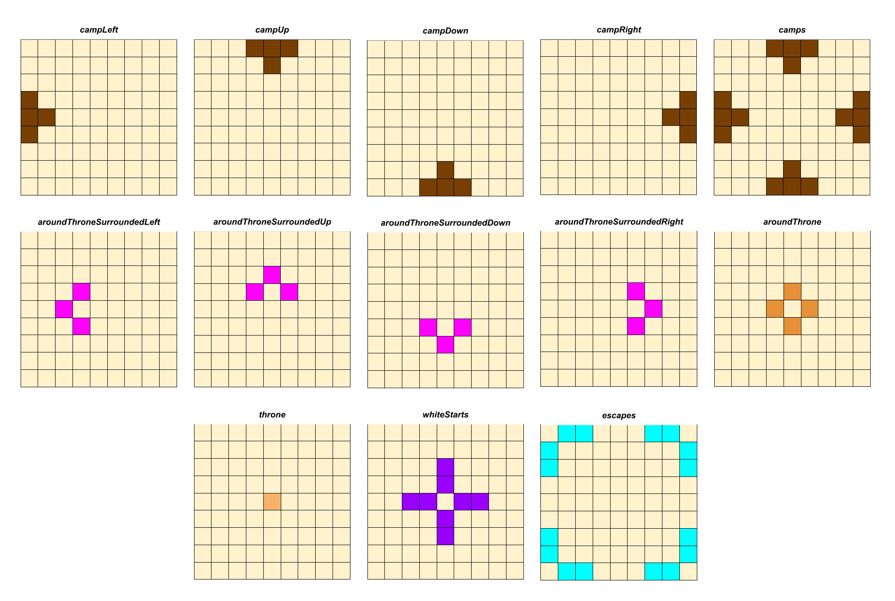

# MelissaILoveTablut

```
 __  __      _ _   
|  \/  | ___| (_)___ ___  __ _ 
| |\/| |/ _ \ | / __/ __|/ _` |
| |  | |  __/ | \__ \__ \ (_| |
|_|  |_|\___|_|_|___/___/\__,_|
 ___        _____     _     _       _   
|_ _|      |_   _|_ _| |__ | |_   _| |_ 
 | |  _   _  | |/ _` | '_ \| | | | | __| 
 | | (  v  ) | | (_| | |_) | | |_| | | 
|___| '._.'  |_|\__,_|_.__/|_|\___/|_| 


```

## Intro

MelissaILoveTablut (MILT) is a player developed for the AI Student Challenge, a tournament where bots created by groups of students compete. The board game chosen for the tournament is Ashton Tablut. You can find the rules [here](http://ai.unibo.it/games/tablut).
We started with a [base repository](https://github.com/AGalassi/TablutCompetition.git) provided by the staff, which mainly contained:

* An implementation of a Random Player Client, demonstrating the communication protocol for interacting with the server.
* A possible state representation of a Tablut game.
* An implementation of the server, useful for testing the bot.

Our task was to implement the algorithm for finding the best move given a Tablut position. We were allowed to use any techniques related to AI, both symbolic and sub-symbolic. The bot could be written in any language as long as it adhered to the communication protocol, with the only limitation being that it couldn't perform any computation during the opponent's turn.
As a group, we decided to develop the bot in Java to be consistent with the given code. We also decided to rely on symbolic AI, using the alpha-beta algorithm for the best-move search, and we implemented our own state representation involving BitBoards. In the following paragraphs, we'll discuss the solutions we adopted.

## State Rapresentation

In the given repository, a Tablut position was represented using an enum matrix. Although enums are relatively efficient in Java, we decided to switch to BitBoards. A BitBoard is a sequence of bits, each corresponding to a cell on the game board. Since each bit can only have 2 values, we needed a BitBoard for each type of piece in a Tablut game. For example, the start position is represented as follows:



Additionally, we used a series of static utility BitBoards, useful for computing the list of possible moves given a Tablut position, and for determining the next Tablut position after applying a move to the current one:



BitBoards provide a simple yet highly efficient way to analyze Tablut positions. For example, suppose the king is in the square to the left of the throne, and we want to determine if it is surrounded by black pawns. We can compute the XOR between the `aroundThroneSurroundedLeft` and the `blacks` BitBoards and then count the number of bits set to one in the result. If this number equals three, the king is surrounded and the black player wins the game.

## Alpha-Beta and Heuristics

For the best-move search we used on the [aima](https://github.com/aimacode/aima-java.git) implementation of the iterative deepening alpha-beta algorithm, so we created a `MILTAction` class rapresenting a move and a `MILTState` class which rapresents a Tablut position and offers the following main methods:

* computation of available moves from the current position (`computeAvailableActions()`)
* computation of a new position obtained applying a move on the current one (`apply(MILTAction)`)

theese two classes also offer methods to parse/cast an entity of the MILT domain from/to an entity of the unibo tablut domain (the one used to interact with the server).

After that we wrapped this classes inside a `MILTGame` class, which implements the `aima.core.search.adversarial.Game` interface, and created a `MILTSearch` class extending `aima.core.search.adversarial.IterativeDeepeningAlphaBetaSearch` which offers the support for the alpha-beta.
For the heuristics we adopted the Visitor pattern, creating two `MILTEvaluator` classes, one for the black and one for the white, acting as visitors of `MILTState`.
Our heuritics considers:

* the difference between black and white pawns
* the number of threatened white and black pawns
* king threats
* the number of potentially available escapes for the king
* the number of effective available escapes for the king
* the number of empty 'ways' where a ways are the square where the white pawns are initially positioned

## Usage

to test the bot position yoursef inside the /tablut/executables folder, and activate the server using the following command

```bash
java -jar server.jar -g -t 10
```

then run the following two commands on two separate prompts in the same folder:

```bash
java -jar milt.jar WHITE 10 localhost
```

```bash
java -jar milt.jar BLACK 10 localhost
```

now you activated the two players, each one having max 10 seconds to find his best move.


## Credits

MelissaILoveTablut makes use of:

* the [base repository](https://github.com/AGalassi/TablutCompetition.git) given by the Student Challenge staff
* the [aima-core](https://github.com/aimacode/aima-java.git) library

The project has been developed by:
* [b3nny01](https://github.com/b3nny01)
* [jjulespop](https://github.com/jjulespop)
* [dagus01-lab](https://github.com/dagus01-lab)
* [bryanber102](https://github.com/bryanber102)

